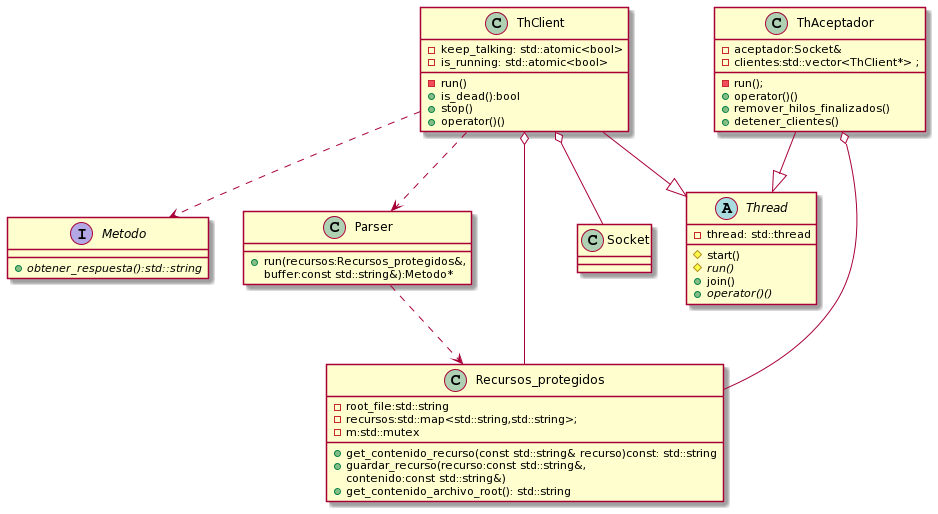
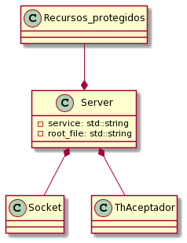

# TP3-Taller

**Descripcion general del trabajo practico**  
Para el trabajo practico se implementaron las clases de Cliente y Servidor para encapsular los comportamientos de cada uno. El servidor se encarga de correr el hilo aceptador, y luego el hilo aceptador corre cada cliente. Cada hilo cliente se encarga de recibir y responder los mensajes del cliente con el cual tiene una conexion a traves de cada socket.   

**Clase Recursos_protegidos**  
Esta clase fue implementada con el fin de encapsular todos los datos accedidos en una clase protegida. Encapsula tanto el mapa de recursos, al cual podria acceder cualquiera de los hilos clientes, ademas de encapsular la apertura del archivo root ingresado al ejecutar el servidor.

**Comentarios adicionales**  
-Para sobrecargar al operador () se implemento que este llamara al metodo start() de los threads. Tanto al metodo start y el metodo run se los definio con visibilidad privada.  
-Para aplicar polimorfismo sobre la resolucion de las respuestas del servidor, se realizo una clase Metodo de la cual heredan las distintas opciones. Si bien se implementaron las clases de los metodos, definiendo en los nombres si tienen recurso o no, se implemento de esta manera para que cada clase concreta de cada metodo sepa como implementar su respuesta.  
-Cuando se recibe un GET/ sin recurso, si el archivo root no puede ser abierto por el programa, se muestra un mensaje de error para no cortar el flujo del programa.  

**Diagrama de clases**  



**correcciones**  
-Agrego un lock en el metodo get_contenido_recurso() de la clase recursos protegidos ya que nates habia una race condition que no se estaba protegiendo como se debia. Ademas, se tuvo remover el 'const' de la funcion que hacia referencia a que la clase Recursos_protegidos no estaba siendo modificada por el metodo.  
-Modifico el llamado al operador << en la clase ThClient, el cual era una race condition,a:  
```
primer_linea_petitorio += "\n";
std::cout << primer_linea_petitorio;
```  
de esta manera solo se realiza un llamado y es atomico.  
-Modifico las lineas:
```
this->peer.cerrar_conexion(SHUT_RD);
this->peer.cerrar_conexion(SHUT_WR);
```  
por:
```
this->peer.cerrar_conexion(SHUT_RDWR);
```
-Cambio la contruccion del cliente en client_main.cpp, ya que antes se estaba copiando, a:  
```
Client cliente(host,service);
```
-Cambio la modificacion del contenedor de ThClient en la clase ThAceptador, de manera que este no se modifique durante la iteracion del mismo, utilizando el metodo swap. Se itera sobre el vector de hilos del cliente, los que no son eliminados se guardan en otro vector clientes_filtrados, y al finalizar la iteracion se realiza un swap entre el vector atributo de la clase ThAceptador y el vector clientes_filtrados.  
-Cambio la firma del metodo "recibir" de la clase Socket, para que ahora reciba un buffer y su tamaño. Ahora las clases que reciban mensajes son las que escriben el buffer sobre un stringstream, para ir concantenando el mensaje recibido, y no como antes que lo hacia el metodo "recibir" del socket.  
-Saco la excepcion que se lanzaba durante la iteracion de la lista de resultados en el metodo "conectar" de la clase Socket que indicaba que habia fallado la creacion del mismo. Ahora solo se lanza excepcion si al finalizar la iteracion no logre conectar.  
-Itero sobre la lista de resultados obtenidos por "getaddrinfo" en el metodo de la clase Socket "bind_and_listen".  
